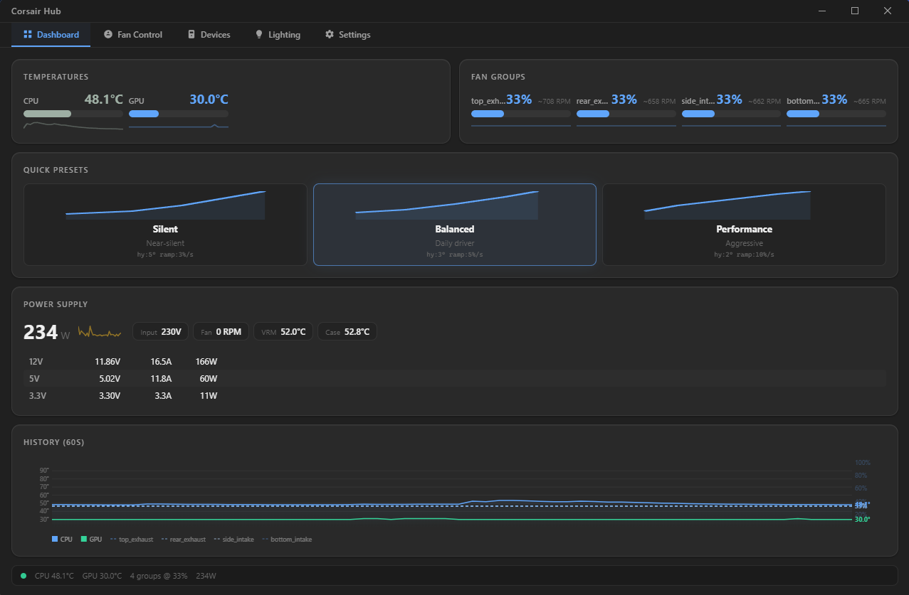

# ai-corsair-hub

A lightweight, open-source replacement for Corsair's iCUE software -- smart fan control, real-time sensor monitoring, and RGB lighting for custom water-cooled PCs built with Corsair iCUE LINK hardware.



## Why?

iCUE is bloated (~500 MB install, ~200 MB RAM), runs telemetry you don't need, and offers no meaningful fan control beyond basic curves. If you have a custom water loop and want **intelligent thermal management** for your Corsair hardware, you shouldn't need half a gigabyte of software to do it.

**ai-corsair-hub** delivers:

- **PID-based fan control** with acoustic optimization -- targets a temperature, not a static curve
- **Real-time sensor fusion** -- CPU, GPU, and PSU telemetry drive fan decisions together
- **Full RGB engine** -- 14 built-in effects with multi-layer compositing, zone control, and sensor-reactive modes
- **Near-zero footprint** -- ~5 MB RAM, <0.1% CPU for the control loop
- **Modern desktop UI** -- Tauri 2.0 + Svelte 5 (uses system WebView2, no bundled Chromium)
- **First open-source Rust implementation** of the Corsair iCUE LINK protocol

## Features

### Fan Control
- **Three control modes**: Fixed duty, temperature curve (draggable SVG editor), and PID controller
- **Four fan groups** with independent control: top exhaust, rear exhaust, side intake, bottom intake
- **Acoustic filter**: asymmetric ramp rates (slow up, slower down), hysteresis bands, minimum duty floor
- **Quick presets**: Silent, Balanced, and Performance -- one-click switching from the dashboard
- **Emergency override**: instant 100% if any sensor hits a critical temperature threshold
- **Hub health monitoring**: automatic recovery from USB communication failures

### Sensor Integration
- **CPU**: temperature via LibreHardwareMonitor HTTP API (Tctl, per-CCD)
- **GPU**: temperature via NVIDIA NVML (core, hotspot)
- **PSU**: Corsair HX1500i monitoring over USB HID -- input/output power, voltage rails (12V/5V/3.3V), VRM and case temperatures, fan RPM
- **Weighted sensor fusion**: configurable per-group sensor weights for multi-source temperature inputs

### RGB Lighting
- **14 built-in effects**: Static, Breathing, Color Cycle, Rainbow Wave, Spectrum Shift, Fire, Aurora, Candle, Starfield, Rain, Temperature Map, Thermal Pulse, Duty Meter, Gradient
- **Multi-layer compositing**: stack multiple effects with blend modes (Normal, Add, Multiply, Screen, Overlay) and per-layer opacity
- **Zone-based control**: assign different effects to fan rings, LED strips, or device groups
- **Sensor-reactive effects**: Temperature Map colors LEDs by live temp, Thermal Pulse pulses between cold/hot colors, Duty Meter visualizes fan speed
- **Noise-driven procedural effects**: Perlin noise for organic Fire, Aurora, Candle, and Rain animations
- **Crossfade transitions**: smooth blending when switching effects
- **Hardware output**: direct color endpoint writes with 508-byte chunking and port power protection

### Desktop Application
- **Dashboard**: real-time temperatures, fan group status with RPM, PSU power draw with rail breakdown, 60-second history chart
- **Fan Control tab**: per-group mode selection, draggable curve editor, PID tuning parameters
- **Devices tab**: hub info with serial, firmware version, connected device tree
- **Lighting tab**: live fan ring and strip preview, effect picker, color/gradient editors, zone configuration, layer stack management, preset system
- **Settings tab**: poll interval, log level, LHM path configuration
- **Dark theme** with custom titlebar and tab navigation

## Supported Hardware

| Device | PID | Status |
|--------|-----|--------|
| iCUE LINK System Hub | `0x0C3F` | Full protocol -- fan control, temp reading, RGB output |
| iCUE LINK QX140 / QX120 fans | via Hub | 34 LEDs each, RPM read, duty set |
| iCUE LINK LS350 Aurora strips | via Hub | RGB output via LINK Adapter |
| Corsair HX1500i PSU | `0x1C1F` | Power, voltage, temperature, fan monitoring |

The iCUE LINK protocol was sourced from [OpenLinkHub](https://github.com/jurkovic-nikola/OpenLinkHub) by Nikola Jurkovic and ported to Rust. PSU protocol follows [liquidctl](https://github.com/liquidctl/liquidctl)'s `corsair_hid_psu` driver.

## Architecture

Rust workspace with 7 crates and 3 CLI/GUI applications:

```
ai-corsair-hub/
├── crates/
│   ├── common/        Shared types: CorsairDevice, AppConfig, Temperature, FanReading, RgbConfig
│   ├── hid/           USB HID layer: device discovery, iCUE LINK data + color endpoint protocol
│   ├── sensors/       Temperature sources: CPU (LHM), GPU (NVML), PSU (HID + LHM)
│   ├── fancontrol/    PID controller, fan curves, acoustic filter, control loop, RGB frame routing
│   └── rgb/           RGB engine: 14 effects, layers, blending, zone renderer, LED layouts
├── apps/
│   ├── gui/           Tauri 2.0 + Svelte 5 desktop application
│   ├── scanner/       CLI: USB device scanner and iCUE LINK hub probe
│   ├── rgb-test/      CLI: RGB protocol validation (cycles red/green/blue on hardware)
│   └── service/       Windows Service daemon [stub]
└── docs/
    ├── architecture.md    Full architecture, protocol status, and roadmap
    └── rgb-protocol.md    iCUE LINK RGB byte-level protocol reference
```

### Data Flow

```
Sensors (CPU/GPU/PSU)
        │
        ▼
   Sensor Fusion ──► Weighted Temperature
        │
        ▼
   PID Controller ──► Raw Duty Cycle
        │
        ▼
   Acoustic Filter ──► Smoothed Duty (ramp rates, hysteresis)
        │
        ▼
   iCUE LINK Hub ──► Fan Hardware
        │
        ▼
   RGB Renderer ──► Color Endpoint ──► LEDs
```

## Quick Start

### Prerequisites

- **Windows 11** (only platform currently supported)
- [Rust](https://rustup.rs/) 1.94+ with MSVC toolchain
- [Node.js](https://nodejs.org/) v24+ (for the Tauri/Svelte frontend)
- MSVC Build Tools 2022 (`winget install Microsoft.VisualStudio.2022.BuildTools`)
- [LibreHardwareMonitor](https://github.com/LibreHardwareMonitor/LibreHardwareMonitor) running with its HTTP server enabled (for CPU/PSU sensor data)
- Corsair iCUE LINK hardware connected via USB

### Build & Run

```bash
# Clone
git clone https://github.com/kenhaesler/ai-corsair-hub.git
cd ai-corsair-hub

# Set PATH (if not already configured)
export PATH="$USERPROFILE/.cargo/bin:/c/Program Files/nodejs:$PATH"

# Build entire workspace
cargo build

# Run tests
cargo test

# --- CLI Tools ---

# Scan Corsair USB devices
cargo run --bin corsair-scanner

# Scan with debug logging
RUST_LOG=corsair_hid=debug cargo run --bin corsair-scanner

# Scan with full protocol trace
RUST_LOG=trace cargo run --bin corsair-scanner

# RGB hardware test (cycles red/green/blue on connected LEDs)
RUST_LOG=corsair_hid=trace cargo run --bin corsair-rgb-test

# --- Desktop Application ---

# Run the GUI (Tauri dev mode)
cd apps/gui/ui && npm install && cd ../../..
cargo tauri dev --manifest-path apps/gui/Cargo.toml
```

### Configuration

The application uses a TOML configuration file. On first run, a default config is created. Fan groups, PID parameters, curve points, and RGB zones are all configurable through the GUI or by editing the config file directly.

Example fan group configuration:

```toml
[[fan_groups]]
name = "top_exhaust"
channels = [1, 2, 3]
hub_serial = "22DE335F6BBA065AA0653243E4BD7AFC"

[fan_groups.mode]
type = "pid"
target_temp = 55.0
kp = 2.0
ki = 0.1
kd = 1.0
min_duty = 25.0
max_duty = 100.0

[fan_groups.mode.temp_source]
sensors = ["cpu", "gpu"]
weights = [0.7, 0.3]
```

## Tech Stack

| Component | Technology | Rationale |
|-----------|------------|-----------|
| Backend | Rust (2024 edition) | Near-zero overhead, memory safety, excellent hidapi support |
| Async | Tokio | Full-featured async runtime for concurrent sensor/hub I/O |
| USB HID | hidapi | Direct HID communication with Corsair devices |
| CPU Sensors | LibreHardwareMonitor | HTTP API bridge for CPU/motherboard/PSU telemetry |
| GPU Sensors | NVML (nvml-wrapper) | NVIDIA Management Library for GPU temperature |
| Frontend | Tauri 2.0 + Svelte 5 | System WebView2, no Chromium, ~3 MB app vs Electron's ~150 MB |
| Config | TOML (serde) | Human-readable, first-class Rust ecosystem support |
| Logging | tracing + tracing-subscriber | Structured, filterable logging with env-filter |

### Resource Budget

| Component | RAM | CPU |
|-----------|-----|-----|
| Fan control loop | < 5 MB | < 0.1% |
| System tray (idle) | < 5 MB | 0% |
| UI (when open) | < 20 MB | < 1% |
| **Total** | **< 30 MB** | **< 1.1%** |
| iCUE (comparison) | ~200-500 MB | ~1-3% |

## Roadmap

| Phase | Description | Status |
|-------|-------------|--------|
| 0 | Foundation: Rust workspace, USB scanner, PID controller | **Complete** |
| 1 | Protocol: iCUE LINK handshake, fan read/write, device enumeration | **Complete** |
| 2 | Sensors: CPU via LHM, GPU via NVML, PSU via HID | **Complete** |
| 3 | Fan Control: PID + acoustic filter, fan groups, hub health monitoring | **Complete** |
| 4 | Desktop UI: Tauri + Svelte dashboard, curve editor, device panel, presets | **Complete** |
| 5 | RGB: Effect engine, multi-layer renderer, lighting UI, hardware output | **Complete** |
| 6 | Polish: installer, auto-update, Windows Service, community docs | **Next** |

### Phase 6 Planned Work
- MSI/NSIS installer for one-click setup
- Auto-update mechanism
- Windows Service registration for boot-time fan control
- Publish iCUE LINK protocol documentation for the community
- Support for additional iCUE LINK device types

## iCUE LINK Protocol

This project implements the Corsair iCUE LINK System Hub protocol (VID `0x1B1C`, PID `0x0C3F`) in Rust, covering both the data and color endpoints:

**Data endpoint** (`0x0D 0x01`):
- Software/hardware mode switching
- Device enumeration across the daisy chain
- Fan RPM reading and duty cycle control
- Temperature sensor reading from connected devices

**Color endpoint** (`0x0D 0x00`):
- RGB LED control via flat buffer writes
- 508-byte chunking with continuation commands
- Port power protection for high LED counts
- Supports QX fans (34 LEDs), LX fans (18 LEDs), LS350 strips, and other LINK devices

See [`docs/rgb-protocol.md`](docs/rgb-protocol.md) for the complete byte-level protocol reference.

## Contributing

Contributions are welcome. Areas where help is especially valuable:

- **Testing on different hardware**: other Corsair LINK devices, Commander Core/Pro, different PSU models
- **USB packet captures**: Wireshark/USBPcap traces for undocumented device types
- **Linux/macOS porting**: hidapi is cross-platform, but sensor sources need platform-specific implementations
- **Protocol documentation**: help expand the iCUE LINK protocol reference

## Acknowledgments

- [OpenLinkHub](https://github.com/jurkovic-nikola/OpenLinkHub) by Nikola Jurkovic -- the Go implementation that made the iCUE LINK protocol accessible to open-source projects
- [liquidctl](https://github.com/liquidctl/liquidctl) -- Python library for Corsair PSU and cooler protocol documentation
- [LibreHardwareMonitor](https://github.com/LibreHardwareMonitor/LibreHardwareMonitor) -- sensor data for CPU, motherboard, and PSU telemetry

## License

[Apache 2.0](LICENSE)
